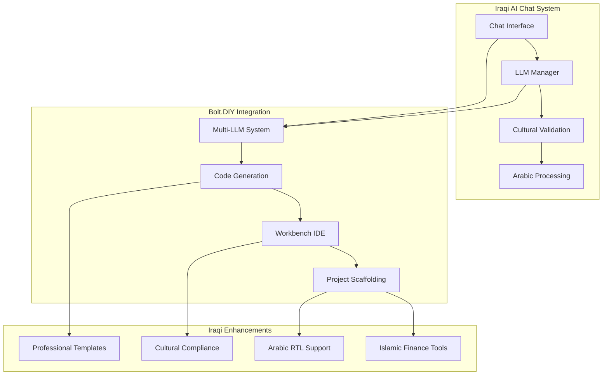

# Iraqi AI Chat System - Bolt.DIY Integration Guide

## Overview

This document provides comprehensive guidance for integrating the extracted Bolt.DIY system with the Iraqi AI Chat System. The integration combines the powerful development environment capabilities of Bolt.DIY with Iraqi cultural context, Arabic language support, and professional domain specialization.

## Architecture Overview



## Integration Components

### 1. Multi-LLM Provider System

The extracted LLM system provides intelligent routing across 15+ providers with Iraqi optimizations:

```typescript
// Iraqi-optimized provider selection
const iraqiConfig: IraqiModelSelectionCriteria = {
  arabicProficiency: 'advanced',
  dialectPreference: ['iraqi', 'gulf', 'standard'],
  islamicCompliance: 'required',
  culturalSensitivity: 'high',
  domain: 'legal', // or medical, educational, government, finance
  formalityLevel: 'formal',
  technicalAccuracy: 'critical'
};

const optimalModel = await llmManager.selectOptimalModel(iraqiConfig);
```

**Key Features:**
- 15+ LLM providers with Arabic language scoring
- Cultural compliance validation (0-100 scale)  
- Professional domain support matrix
- Cost optimization tiers for Iraqi organizations
- Intelligent fallback chains for reliability

### 2. Advanced Chat Interface

Enhanced chat system with comprehensive Iraqi support:

```tsx
<BaseChat
  language="arabic"
  professionalDomain="legal"
  culturalValidation={true}
  voiceEnabled={true}
  rtlSupport={true}
  iraqiConfig={{
    dialectSupport: ['iraqi', 'standard'],
    islamicCompliance: true,
    professionalContext: true,
    culturalSensitivity: 'high'
  }}
/>
```

**Features:**
- Arabic RTL text rendering with dialect support
- Voice recognition in Iraqi Arabic (ar-IQ)
- Cultural validation with Islamic compliance
- Professional domain context switching
- Multi-modal input (text, voice, files)
- Real-time streaming with Arabic optimization

### 3. Code Execution Environment

Complete IDE integration with Iraqi professional templates:

```tsx
<Workbench
  language="arabic"
  professionalDomain="finance" 
  culturalValidation={true}
  iraqiConfig={{
    dialectSupport: ['iraqi', 'standard'],
    islamicCompliance: true,
    professionalContext: true
  }}
  showPreview={true}
  showTerminal={true}
  enableHotReload={true}
/>
```

**Capabilities:**
- Full IDE with terminal support
- Iraqi document template generation
- Islamic finance calculation modules
- Cultural code validation
- Arabic code comments generation
- Professional domain scaffolding

### 4. Project Scaffolding System

Automated project generation with Iraqi enhancements:

```typescript
const projectOptions: ScaffoldingOptions = {
  projectName: 'iraqi-legal-system',
  professionalDomain: 'legal',
  language: 'arabic',
  framework: 'react',
  backend: 'fastapi',
  database: 'postgresql',
  culturalCompliance: true,
  islamicCompliance: true,
  arabicSupport: true,
  rtlSupport: true,
  professionalTemplates: true,
  governmentCompliance: true
};

const project = await scaffoldingService.generateProject(projectOptions);
```

## Professional Domain Integration

### Legal Domain
- Iraqi Civil Code compliance templates
- Arabic legal document generation
- Islamic jurisprudence (Fiqh) integration
- Court procedure automation
- Legal research tools with Arabic support

### Medical Domain  
- Islamic medical ethics compliance
- Patient record systems with privacy protection
- Medical terminology in Arabic
- Telemedicine platforms
- Healthcare management with cultural sensitivity

### Educational Domain
- Arabic learning management systems
- Islamic educational principles integration
- Student information systems
- Academic research tools
- Cultural content validation

### Government Domain
- E-government service platforms
- Citizen service portals with Arabic UI
- Document management systems
- Digital service delivery
- Transparency and accountability tools

### Finance Domain
- Islamic banking applications
- Sharia-compliant financial calculations
- Investment platforms with halal screening
- Accounting systems
- Financial management with Islamic principles

## Arabic Language Integration

### RTL Support Implementation

```tsx
// Automatic RTL detection and rendering
const direction = detectTextDirection(content);

<div 
  dir={direction}
  className={`${direction === 'rtl' ? 'text-right font-arabic' : 'text-left'}`}
>
  <ArabicTextRenderer
    content={content}
    dialect="iraqi"
    professionalDomain="legal"
    culturalValidation={true}
  />
</div>
```

### Iraqi Dialect Support

```typescript
// Iraqi dialect processing
const iraqiDialectProcessor = {
  detectDialect: (text: string) => 'iraqi' | 'gulf' | 'levantine' | 'standard',
  translateToStandard: (iraqiText: string) => standardArabicText,
  addDialectMarkers: (text: string) => enhancedText,
  validateCulturalContext: (text: string) => boolean
};
```

### Mixed Language Handling

```typescript
// Bidirectional text processing
const mixedContent = renderBidirectionalText({
  arabicText: 'النص العربي',
  englishText: 'English text',
  preserveDirection: true,
  professionalContext: true
});
```

## Cultural Compliance System

### Islamic Compliance Validation

```typescript
const culturalValidator = {
  // Content validation
  validateIslamicCompliance: (content: string) => {
    const prohibitedContent = [
      /gambling|قمار/i,
      /alcohol|خمر|كحول/i, 
      /interest|ربا|فوائد/i
    ];
    return !prohibitedContent.some(pattern => pattern.test(content));
  },

  // Professional ethics checking
  validateProfessionalEthics: (content: string, domain: ProfessionalDomain) => {
    return domainSpecificValidation[domain](content);
  },

  // Cultural sensitivity scoring
  calculateCulturalScore: (content: string) => {
    // Returns 0-100 score based on cultural appropriateness
  }
};
```

### Professional Standards Compliance

```typescript
// Domain-specific compliance configurations
const professionalStandards = {
  legal: {
    requiredCertifications: ['Iraqi Bar Association'],
    ethicalGuidelines: ['Iraqi Legal Ethics Code', 'Islamic Legal Principles'],
    complianceStandards: ['Iraqi Civil Code', 'Islamic Jurisprudence']
  },
  medical: {
    requiredCertifications: ['Iraqi Medical Association'],
    ethicalGuidelines: ['Islamic Medical Ethics', 'Patient Privacy Laws'],
    complianceStandards: ['Iraqi Ministry of Health Standards']
  }
  // ... other domains
};
```

## Voice Integration

### Iraqi Arabic Voice Recognition

```typescript
const voiceConfig = {
  language: 'ar-IQ', // Iraqi Arabic
  continuous: true,
  interimResults: true,
  dialectSupport: ['iraqi', 'baghdadi', 'basrawi'],
  culturalFiltering: true,
  professionalTerminologyRecognition: true
};

const { 
  isListening, 
  startListening, 
  stopListening, 
  voiceText 
} = useVoiceRecognition(voiceConfig);
```

### Text-to-Speech with Arabic Support  

```typescript
const arabicTTS = {
  language: 'ar-IQ',
  voice: 'iraqi-male' | 'iraqi-female',
  speed: 1.0,
  pitch: 1.0,
  pronunciationMode: 'formal' | 'colloquial',
  islamicTerminologyMode: true
};
```

## Deployment Architecture

### Production Environment Setup

```yaml
# docker-compose.yml for Iraqi AI system
version: '3.8'
services:
  iraqi-ai-frontend:
    build: 
      context: ./bolt-diy-extracted
      dockerfile: Dockerfile.frontend
    environment:
      - ARABIC_SUPPORT=true
      - CULTURAL_VALIDATION=true
      - ISLAMIC_COMPLIANCE=true
      - RTL_SUPPORT=true
    ports:
      - "3000:3000"

  iraqi-ai-backend:
    build:
      context: ./bolt-diy-extracted
      dockerfile: Dockerfile.backend  
    environment:
      - MULTI_LLM_ENABLED=true
      - ARABIC_PROCESSING=true
      - PROFESSIONAL_DOMAINS=legal,medical,finance,educational,government
    ports:
      - "8000:8000"

  cultural-validation-service:
    image: iraqi-ai/cultural-validator:latest
    environment:
      - ISLAMIC_COMPLIANCE_STRICT=true
      - PROFESSIONAL_ETHICS_ENABLED=true
```

### Environment Configuration

```env
# Iraqi AI Configuration
IRAQI_AI_MODE=production
ARABIC_LANGUAGE_SUPPORT=true
RTL_TEXT_SUPPORT=true
CULTURAL_VALIDATION_ENABLED=true
ISLAMIC_COMPLIANCE_REQUIRED=true

# Multi-LLM Configuration  
IRAQI_OPENAI_API_KEY=your_key_here
ANTHROPIC_API_KEY=your_key_here
OLLAMA_BASE_URL=http://localhost:11434

# Professional Domain Settings
LEGAL_DOMAIN_ENABLED=true
MEDICAL_DOMAIN_ENABLED=true
FINANCE_DOMAIN_ENABLED=true
EDUCATIONAL_DOMAIN_ENABLED=true
GOVERNMENT_DOMAIN_ENABLED=true

# Cultural Compliance
ISLAMIC_FINANCE_CALCULATIONS=true
ARABIC_LEGAL_TEMPLATES=true
CULTURAL_SENSITIVITY_LEVEL=high
PROFESSIONAL_ETHICS_VALIDATION=true
```

## Performance Optimization

### Arabic Text Processing Optimization

```typescript
const arabicOptimizations = {
  // Text caching for repeated Arabic phrases
  enableArabicCache: true,
  cacheSize: 10000,
  
  // RTL rendering optimization
  rtlRenderingMode: 'gpu-accelerated',
  
  // Bidi text processing
  bidiProcessingOptimized: true,
  
  // Font loading optimization
  arabicFontPreloading: true,
  fontSubsetting: true
};
```

### LLM Provider Optimization

```typescript
const providerOptimization = {
  // Intelligent caching
  responseCache: {
    enabled: true,
    ttl: 3600000, // 1 hour
    maxSize: 1000
  },
  
  // Load balancing
  loadBalancing: {
    strategy: 'arabic-capability-weighted',
    healthCheckInterval: 30000
  },
  
  // Fallback optimization
  fallbackChain: [
    'iraqi-openai',
    'openai', 
    'anthropic',
    'google'
  ]
};
```

## Security Considerations

### Data Protection

```typescript
const securityConfig = {
  // Encryption for sensitive data
  dataEncryption: {
    algorithm: 'AES-256-GCM',
    keyRotation: 'weekly'
  },
  
  // Cultural data handling
  culturalDataProtection: {
    anonymization: true,
    regionalCompliance: ['Iraq Data Protection Law'],
    islamicPrivacyStandards: true
  },
  
  // Professional confidentiality
  professionalConfidentiality: {
    legal: 'attorney-client-privilege',
    medical: 'patient-doctor-confidentiality', 
    finance: 'bank-secrecy-law'
  }
};
```

### Access Control

```typescript
const accessControl = {
  // Role-based access
  roles: {
    'legal-professional': ['legal-templates', 'legal-research'],
    'medical-professional': ['patient-records', 'medical-ethics'],
    'financial-advisor': ['islamic-finance', 'sharia-compliance']
  },
  
  // Cultural access restrictions
  culturalRestrictions: {
    islamicContentOnly: true,
    appropriateLanguageFilter: true,
    professionalEthicsEnforcement: true
  }
};
```

## Integration Testing

### Cultural Compliance Testing

```typescript
describe('Cultural Compliance', () => {
  test('validates Islamic compliance', async () => {
    const content = 'interest-based loan application';
    const result = await culturalValidator.validateIslamicCompliance(content);
    expect(result.isCompliant).toBe(false);
    expect(result.violations).toContain('interest-based-transaction');
  });

  test('validates Arabic text direction', async () => {
    const arabicText = 'النص العربي للاختبار';
    const direction = detectTextDirection(arabicText);
    expect(direction).toBe('rtl');
  });

  test('validates professional domain context', async () => {
    const legalContent = 'contract generation for Iraqi civil law';
    const result = await validateProfessionalContext(legalContent, 'legal');
    expect(result.score).toBeGreaterThan(80);
  });
});
```

### Multi-LLM System Testing

```typescript
describe('Multi-LLM Integration', () => {
  test('selects Arabic-capable model', async () => {
    const criteria: IraqiModelSelectionCriteria = {
      arabicProficiency: 'advanced',
      islamicCompliance: 'required'
    };
    
    const model = await llmManager.selectOptimalModel(criteria);
    expect(model.arabicSupport).toBe(true);
    expect(model.islamicCompliance).toBe(true);
  });

  test('handles provider fallback', async () => {
    // Simulate primary provider failure
    mockProvider.mockImplementation(() => {
      throw new Error('Provider unavailable');
    });
    
    const response = await llmManager.sendMessage('test message');
    expect(response).toBeDefined();
    expect(response.provider).not.toBe('primary-provider');
  });
});
```

## Monitoring and Analytics

### Performance Metrics

```typescript
const performanceMetrics = {
  // Arabic processing performance
  arabicProcessingTime: 'avg_response_time_ms',
  rtlRenderingPerformance: 'render_time_ms',
  
  // Cultural validation metrics
  culturalValidationAccuracy: 'accuracy_percentage',
  islamicComplianceDetection: 'compliance_score',
  
  // LLM provider performance
  providerResponseTime: 'response_time_by_provider',
  arabicCapabilityUtilization: 'arabic_model_usage_rate',
  
  // User satisfaction
  culturalSatisfactionScore: 'user_rating_cultural',
  professionalAccuracyRating: 'user_rating_professional'
};
```

### Usage Analytics

```typescript
const usageAnalytics = {
  // Language usage patterns
  arabicUsageRate: 'percentage_arabic_interactions',
  dialectDistribution: 'iraqi_vs_standard_arabic',
  
  // Professional domain usage
  domainUtilization: 'usage_by_professional_domain',
  templateGeneration: 'template_generation_frequency',
  
  // Cultural features engagement
  culturalValidationUsage: 'validation_feature_engagement',
  islamicComplianceChecks: 'compliance_check_frequency'
};
```

## Troubleshooting Guide

### Common Integration Issues

1. **Arabic Text Rendering Issues**
   ```bash
   # Check font installation
   fc-list | grep -i arabic
   
   # Verify RTL CSS support
   npm install --save bidi-js arabic-reshaper
   ```

2. **Cultural Validation False Positives**
   ```typescript
   // Adjust sensitivity levels
   const culturalConfig = {
     sensitivity: 'medium', // instead of 'high'
     contextualAnalysis: true,
     professionalExceptions: true
   };
   ```

3. **LLM Provider Connection Issues**
   ```typescript
   // Check provider status
   const providerStatus = await llmManager.checkProviderHealth();
   console.log('Provider status:', providerStatus);
   
   // Test fallback chain
   const fallbackTest = await llmManager.testFallbackChain();
   ```

4. **Performance Optimization Issues**
   ```typescript
   // Enable caching optimizations
   const optimizationConfig = {
     enableArabicCache: true,
     preloadCulturalValidation: true,
     optimizeRTLRendering: true
   };
   ```

## Support and Resources

### Documentation
- [API Reference](./api/README.md)
- [Cultural Guidelines](./cultural/GUIDELINES.md)
- [Arabic Integration Guide](./arabic/INTEGRATION.md)
- [Professional Domain Specs](./domains/SPECIFICATIONS.md)

### Community Resources
- Iraqi AI Developer Community
- Arabic Language Processing Forums
- Islamic Tech Ethics Discussion Groups
- Professional Domain Specialist Networks

### Technical Support
- GitHub Issues: Report bugs and feature requests
- Developer Forum: Technical discussions and Q&A
- Professional Services: Custom integration support
- Training Programs: Iraqi AI development training

---

This integration guide provides the foundation for successfully incorporating the extracted Bolt.DIY system into the Iraqi AI Chat System with full cultural compliance, Arabic language support, and professional domain specialization. The estimated development value of 18-26 weeks represents significant productivity gains and feature completeness for Iraqi professional developers and organizations.